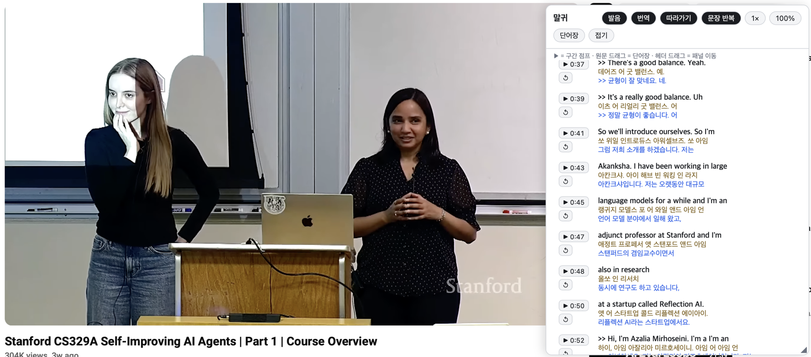

# Malgwi

**Malgwi** (Korean 말귀, "an ear for words"; pronounced *mal-gwee* — from
the idiom *malgwiga teuida*, "when your ears finally open to a
language") turns any YouTube video into a language-study experience.



<sub>\* The screenshot shows the panel over a publicly available Stanford
Online lecture, for demonstration only. If you believe this screenshot
infringes any copyright or other rights, please open an issue — it will
be corrected or removed immediately.</sub>

A study panel appears right on the YouTube watch page you already use:

- **Original subtitles** with **pronunciation** rendered in your script
  and a natural **translation** in your language
- The current line highlights and follows playback
- **Jump** (`▶`) to any line; **repeat** (`↺`) a line or the whole
  spoken sentence — once, in a loop, or off
- **Vocabulary book**: drag any word in the original text to save it,
  with its meaning, real usage examples from the video, and a
  one-click dictionary lookup
- Playback speed, panel opacity, drag-to-move, resize — all remembered

A lesson pairs one source-language video with one **study language**
(Korean learners watching English lectures, English or Chinese learners
watching Korean videos, and so on). The panel UI follows your system
language (English, Korean, Chinese, Japanese).

Everything runs locally in your browser. No account, no server, no AI
at view time, and nothing leaves your machine.

> **Malgwi is not a live translator.** Lessons are prepared **per
> video, ahead of time**: you author them once with
> [`bun compiler/author.ts`](#author) (or any host that calls the same
> toolkit), then compile into your userscript. The study panel appears
> on prepared videos; on any other video you get a short
> *not in your library* notice — not a create form. One-time
> preparation per video, then unlimited offline-quality studying.

---

## Studying with Malgwi

You need a lesson userscript — a single `.user.js` file built for the
videos you study (see [Building lessons](#building-lessons) below).

### 1. Install a userscript manager

| Browser | Install |
|---|---|
| Chrome / Edge / Firefox | [Tampermonkey](https://www.tampermonkey.net/) |
| Safari (macOS/iOS) | [Userscripts](https://apps.apple.com/app/userscripts/id1463298887) (free, App Store) |

### 2. Install your lesson file

- **Tampermonkey**: dashboard → Utilities → import the `.user.js` file
  (or drag it into the dashboard).
- **Userscripts (Safari)**: enable the extension in Safari settings,
  pick a scripts folder in the Userscripts app, and copy the `.user.js`
  file into that folder.

Use `study-library.user.js` (all your videos in one install) rather
than per-video files; rebuilding the library and replacing that one
file updates everything.

### 3. Open the video on YouTube

Visit the video on `youtube.com` as usual. The Malgwi panel appears on
the right for any video in your library. On videos you have not
prepared, a short status notice appears instead — the userscript is
playback-only and does not author lessons in the browser. Switching
between videos just works — the panel follows YouTube's in-page
navigation.

### The study loop

Adding a video to your library is a one-time preparation:

1. Pick a video and get its subtitles as a file (see
   [Getting subtitles](#getting-subtitles)).
2. Author the lesson and rebuild the library userscript (see
   [Building lessons](#building-lessons)):

   ```sh
   export OPENROUTER_API_KEY=…
   bun compiler/author.ts --captions capture.vtt --video-id VIDEO --study-language ko
   bun compiler/build.ts --library study-library.user.js lesson.json
   ```

3. Replace your installed `study-library.user.js` with the rebuilt one.
4. Study: every prepared video now shows the panel, forever, with no
   further cost.

### Panel controls

| Control | What it does |
|---|---|
| `▶ 0:42` | Jump to that line and play (cancels any active repeat) |
| `↺` | Repeat: 1st press replays the sentence once, 2nd press loops it, 3rd press turns it off |
| Sentence chip | Toggle repeat scope: full spoken sentence (default) or single caption cue |
| Pronunciation / Translation chips | Show or hide those lines |
| Follow chip | Auto-scroll to the current line |
| `1×` | Cycle playback speed 1× → 0.75× → 0.5× |
| `100%` | Cycle panel opacity 100 → 85 → 65 → 45% |
| Vocabulary chip | Switch between subtitles and your vocabulary book |
| Drag a word in the original text | Offers one-click capture into the vocabulary book |
| Drag the header | Move the panel anywhere (it undocks) |
| `◢` bottom-right grip | Resize the panel |
| Collapse chip | Fold the panel into a side tab |
| `✕` | Turn Malgwi off entirely; bring it back via the small dot at the screen edge, `Alt+M` (`⌥M`), or the Tampermonkey menu entry |

Vocabulary entries and panel placement live in your browser's
`localStorage` only.

---

## Building lessons

Preparation is a two-step loop on your machine; playback stays
offline in the browser.

1. **Author** — [`compiler/author.ts`](#author) reads a local caption
   file, calls a language model once to fill `pronunciation` and
   `translation`, and writes sealed `lesson-v2` JSON. Credentials come
   from the environment only; the key is never written into lesson
   JSON, logs, or the userscript.
2. **Compile** — [`compiler/build.ts`](#compile) validates the lesson,
   binds the original text to the capture with a SHA-256 digest so it
   cannot be silently altered, and emits static artifacts. No model
   calls; same input yields byte-identical output.

The watch-page library userscript is playback-only (`@grant none`): no
model HTTP, no API key UI. Other hosts or scripts can call the same
[`src/authoring.ts`](src/authoring.ts) toolkit; this repo ships the
CLI as the first-class path.

```
subtitles (.vtt/.srt/json)     author CLI              lesson-v2 JSON       compile
        │                         │                         │                  │
        └──── parse + digest ─────┴──► pronunciation, ──────┴──► index.html   │
                                      translation                 study.user.js │
                                                                study-library.user.js
```

### The lesson-v2 document

The full contract is
[`schema/lesson-v2.schema.json`](schema/lesson-v2.schema.json). The
shape:

```jsonc
{
  "schema_version": 2,
  "video": { "provider": "youtube", "video_id": "abc123XYZ_-",
             "source_language": "en", "title": "…" },
  "study_language": "ko",
  "source_digest": "…",            // sha256 of the canonical caption list
  "lines": [
    { "start_ms": 400, "end_ms": 2100,
      "original": "What are you doing here?",   // verbatim capture
      "pronunciation": "왓 아 유 두잉 히어?",      // source speech, learner's script
      "translation": "여기서 뭐 하고 있어?",       // learner's language
      "sentence_end": true }                     // optional: sentence boundary
  ],
  "glossary": [                                  // optional: vocabulary meanings
    { "word": "town", "meaning": "마을, 동네" }
  ]
}
```

Rules that make a lesson trustworthy:

- `original`, `start_ms`, `end_ms` come verbatim from the captured
  subtitles; `source_digest` (SHA-256 over the canonical capture) lets
  any host verify nothing was silently altered.
- The model authors **only** `pronunciation`, `translation`, optional
  `sentence_end` flags, and optional glossary meanings.
- See [`fixtures/lesson.sample.json`](fixtures/lesson.sample.json) for
  a complete synthetic example.

### Author

Requires [Bun](https://bun.sh) and an API key in the environment.
The CLI refuses `--api-key`; set `OPENROUTER_API_KEY` or
`OPENAI_API_KEY` instead. Optional overrides:
`OPENROUTER_BASE_URL` / `OPENAI_BASE_URL` (and `OPENROUTER_MODEL` /
`OPENAI_MODEL` for the default model).

Required flags:

- `--captions` — local `.vtt`, `.srt`, or neutral JSON capture
- `--video-id` — YouTube video id
- `--study-language` — BCP-47-ish tag for the learner (e.g. `ko`)

Optional flags: `--source-language` (default `en`), `--title`,
`--output` (default `lesson.json`), `--model`.

```sh
export OPENROUTER_API_KEY=…
bun compiler/author.ts --captions capture.vtt --video-id VIDEO --study-language ko
bun compiler/build.ts --library study-library.user.js lesson.json
```

(`bun run author -- …` runs the same entry point.)

### Compile

Requires [Bun](https://bun.sh).

```sh
# one video -> out/index.html + out/study.user.js + out/lesson.json
bun compiler/build.ts lesson.json out/

# every studied video -> one installable library userscript
bun compiler/build.ts --library study-library.user.js \
    lesson1.json lesson2.json lesson3.json
```

Builds are deterministic: same input, byte-identical output.

### Getting subtitles

Subtitle acquisition is out of scope by design: bring your own subtitle
files (`.vtt`, `.srt`, or a neutral
`[{"start_ms","end_ms","text"}]` JSON) — exports of your own videos,
files you legitimately have, or openly licensed sources. Read
[`LEGAL_REVIEW.md`](LEGAL_REVIEW.md) before adding any automated
fetcher to a host.

### The standalone page

`out/index.html` is a self-contained study page with an embedded
player. Serve it over HTTP (`python3 -m http.server`) rather than
opening the file directly — YouTube requires a referrer for embedded
playback. When a video's owner disables embedding, the page degrades
gracefully to a floating video window driven by the same jump buttons.

---

## FAQ

**Why doesn't the panel appear on some video?**
It is not in your library. You may see a short *not in your library*
status instead of the study panel — there is no in-browser create form.
Prepare the video with [`bun compiler/author.ts`](#author), rebuild the
library (see [the study loop](#the-study-loop)), and reinstall the
userscript.

**Can it translate any video live?**
No, by design. Translation happens once when you run
[`bun compiler/author.ts`](#author); at view time the userscript does
no model HTTP and holds no API key. That is what keeps studying free,
fast, and private.

**Do my vocabulary words leave my browser?**
No. Vocabulary and panel settings live in your browser's
`localStorage` only.

---

## Repository layout

- `schema/` — the lesson-v2 JSON Schema (legacy v1 upgrades
  transparently)
- `runtime/` — the three pinned templates (page, per-video userscript,
  library userscript); no build step, the compiler injects escaped JSON
  into a fixed slot
- `compiler/author.ts` — local CLI that authors sealed lesson-v2 from
  caption files (model calls; credentials from the environment only)
- `compiler/build.ts` — deterministic builders and the compile CLI
- `src/authoring.ts` — caption-to-lesson conversion and model batching
  (shared by the author CLI and tests)
- `src/captions.ts` — parse `.vtt` / `.srt` / JSON caption files
- `src/lesson.ts` — validation, canonicalization, digests, injection
  (zero dependencies)
- `scripts/pin.ts` — emits the commit + SHA-256 pin record a host embeds
  next to its frozen template copies
- `fixtures/`, `tests/` — synthetic dialogue fixtures; contract tests,
  injection-safety tests, and a DOM-stub smoke test that executes the
  compiled userscript

## Design rules

1. The model never writes HTML or JavaScript. It fills data fields in
   `lesson-v2`; every artifact is a pinned template plus injected,
   escaped JSON.
2. `original` is verbatim capture output; the digest makes silent edits
   detectable.
3. Lesson text reaches the DOM through `textContent` only, and the
   inline JSON escapes `<`, U+2028, and U+2029, so hostile subtitle
   text cannot escape the script block.
4. Generated artifacts are local, personal study material; nothing here
   deploys, publishes, or shares them.
5. Playback always stays on youtube.com — the official IFrame player in
   the page, or the real watch page under the userscripts. No stream
   extraction, ever.

## Contributing

Malgwi is developed solo: **pull requests are not accepted** and are
closed automatically (see
[CONTRIBUTING.md](.github/CONTRIBUTING.md)). Bug reports and ideas are
very welcome through
[issues](https://github.com/dhihm/malgwi/issues/new/choose) — the forms
ask for the screenshot and environment details that make problems
fixable. Forks are always fine under the MIT license.

## License

[MIT](LICENSE)
